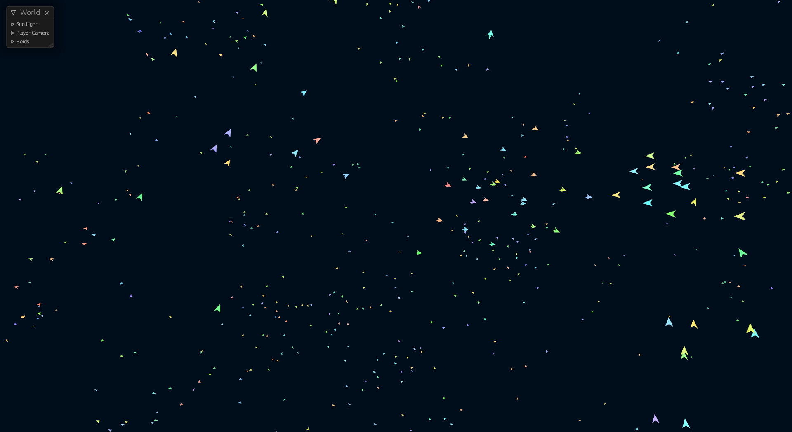

# Boids

I made this project as a way to learn the Bevy Game Engine as well as to finally finish a project that I planned on completing months (possibly a year or more) ago.

The project is an implementation of the [artificial life simulation of the same name](https://en.wikipedia.org/wiki/Boids). It showcases emergent behaviour of a few simple rules.

## How to Run

You have two options, you can download the packages from the releases tab (which may or may not be out of date) or build the project yourself using Rust.

To build the project, download the Rust toolchain from [the official website](https://www.rust-lang.org/tools/install), or if you are using Linux then download rust using your respective package manager.

In the root directory of the project, run `cargo build --release` to build the release executable.

> Please note that the assets folder does not automatically get placed alongside the release executable. Move the assets folder next to the executable if you don't want to be met with a blank screen.

## How to Play

- WASD to Move
- E/Q to Move Up/Down
- Shift to Move Fast
- Mouse to Turn
- Escape to Regain Control of your Mouse
- ALT-F4 to close on Windows or simply press the close button

Have fun watching the colorful boids.
